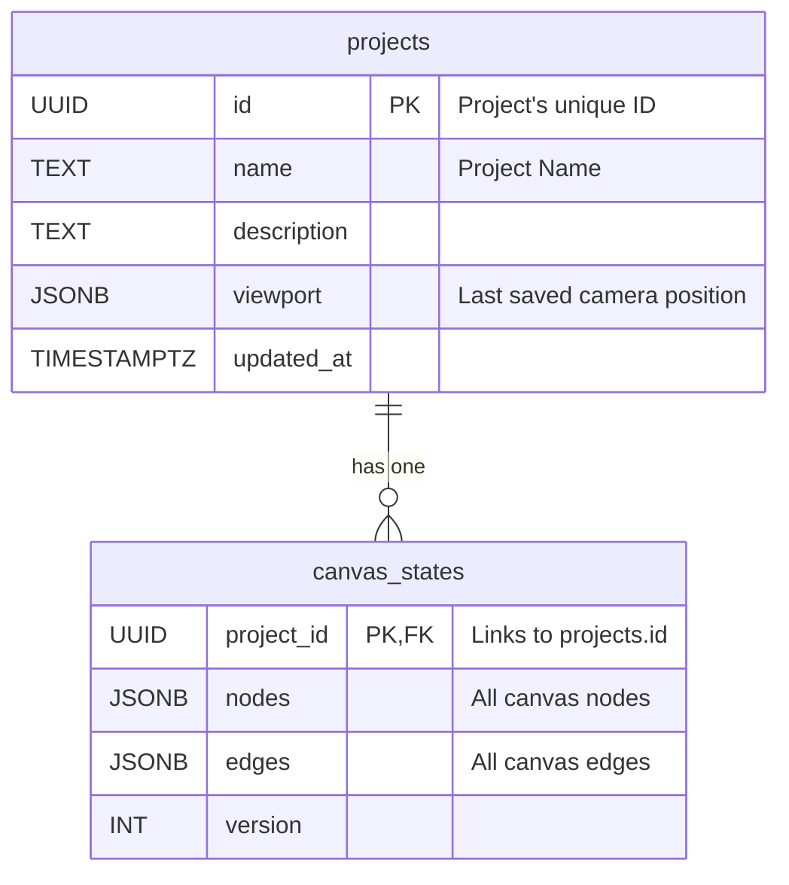
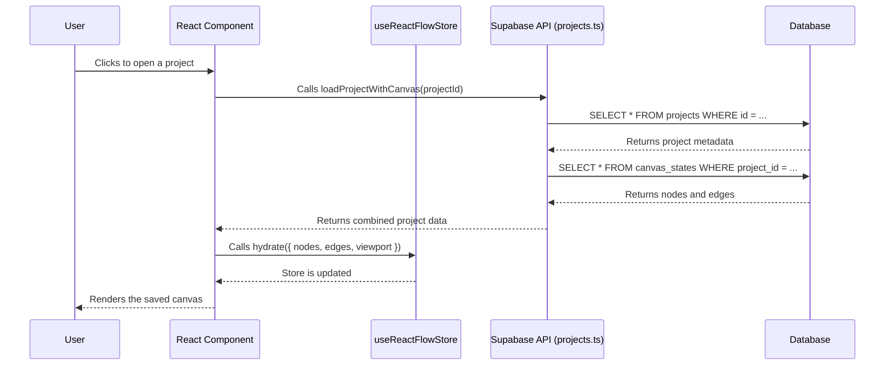
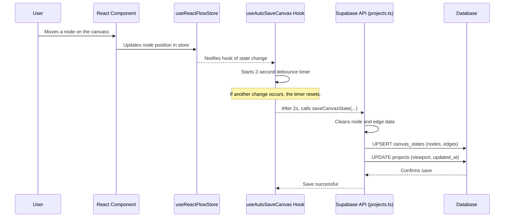

# State Management Flow: Frontend to Supabase

This document outlines the complete state management flow for the AI Context Organizer application, detailing how the frontend (Next.js, React Flow, Zustand) interacts with the Supabase backend.

### 1. Database Schema: The Foundation

The database schema in Supabase is the foundation of our state management. It consists of two primary tables: `projects` and `canvas_states`.

-   **`projects`**: This table stores metadata for each project, including its name, description, and the last saved viewport (camera position). It acts as the master record.
-   **`canvas_states`**: This table stores the core content of the canvas, which includes the `nodes` and `edges` of the React Flow diagram.

A one-to-one relationship exists between these tables, linked by the `project_id`.

### 2. State Retrieval: Loading a Project

When a user opens a project, the application fetches the state from Supabase and renders it on the canvas.

**Step-by-Step Flow:**

1.  **User Action**: The user selects a project from the UI.
2.  **API Call**: The frontend triggers the `loadProjectWithCanvas(projectId)` function.
3.  **Fetch Data**: This function makes two requests to Supabase:
    -   Fetches project metadata from the `projects` table.
    -   Fetches the corresponding `nodes` and `edges` from the `canvas_states` table.
4.  **Hydrate Store**: The retrieved data is used to hydrate the `useReactFlowStore` (our Zustand store), populating it with the project's state.
5.  **Render Canvas**: The `ReactFlowCanvas` component, subscribed to the store, re-renders to display the loaded canvas.

### 3. State Persistence: Auto-Saving the Canvas

To prevent data loss, changes made to the canvas are automatically saved to Supabase in the background.

**Step-by-Step Flow:**

1.  **User Action**: The user modifies the canvas (e.g., moves a node, adds an edge).
2.  **Store Update**: The action updates the state (`nodes`, `edges`, `viewport`) within `useReactFlowStore`.
3.  **Hook Detection**: The `useAutoSaveCanvas` custom hook detects the state change.
4.  **Debounce**: The hook waits for a 2-second period of inactivity before proceeding, preventing excessive database writes.
5.  **API Call**: Once the debounce timer completes, the hook calls the `saveCanvasState` function.
6.  **Data Cleaning & Save**:
    -   The `saveCanvasState` function first cleans the node and edge data to remove UI-specific properties.
    -   It then performs two operations: an `upsert` to the `canvas_states` table with the new nodes and edges, and an `update` to the `projects` table with the latest viewport and timestamp.

### Summary

The application's state management is a robust, cyclical flow:

-   **Client-Side State**: The `useReactFlowStore` (Zustand) serves as the reactive single source of truth for the UI.
-   **Persistence Layer**: The functions in `lib/supabase/projects.ts` provide a clear API for database interactions.
-   **Connecting Bridge**: The `useAutoSaveCanvas` hook intelligently bridges the client and server, ensuring that state is efficiently and reliably persisted from the Zustand store to Supabase.
